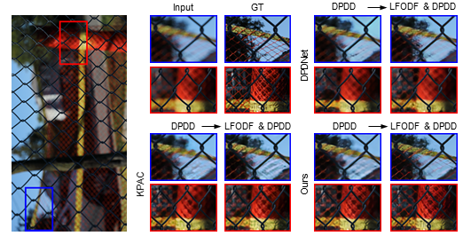

# DPDNet (Performance Gain)


This repository contains improved version of DPDNet when adopting the training strategy in the following paper:

> **[Learning to Deblur using Light Field Generated and Real Defocused Images](placeholder)**<br>
> Lingyan Ruan<sup>\*</sup>, Bin Chen<sup>\*</sup>, Jizhou Li, Miuling Lam （\* equal contribution）

<p align="left">
  <a>
    
  </a><br>
</p>

<!--  -->

The orignial DPDNet can be found **[Here](https://github.com/Abdullah-Abuolaim/defocus-deblurring-dual-pixel)** .

## Code Here

### Prerequisites

Notes: the code may also work with other library versions that didn't specify here.

Table 4 in our main paper.

#### 1. Installation

Clone this project to your local machine

```bash
$ git clone https://github.com/lingyanruan/DPDNet.git
$ cd DPDNet
```

#### 2. Pre-trained models

Download and unzip [pretrained weights](placeholder) under `./ModelCheckpoints/`:

#### 3. Datasets

Download and unzip test sets [DPDD](https://github.com/Abdullah-Abuolaim/defocus-deblurring-dual-pixel) under folder `./DPD/`

#### 4. Command Line

```shell
python main.py
```

## Contact

Should you have any questions, please open an issue or contact me [lyruanruan@gmail.com](mailto:lyruanruan@gmail.com)

## License

This software is being made available under the terms in the [LICENSE](LICENSE) file.
